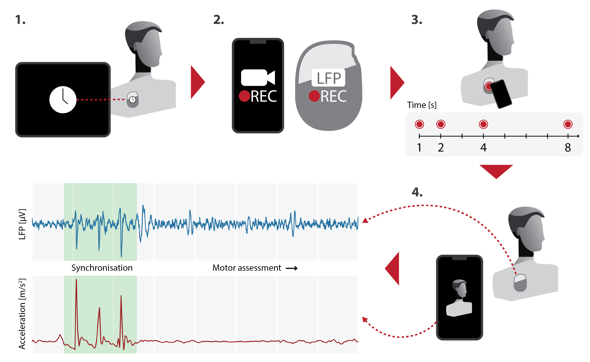

# Synchronising **LFP** and **Video** Data

Several deep brain stimulation (DBS) systems now allow for simultaneous stimulation and local field potential (LFP) recording. While conventional DBS is an effective therapy for neurological disorders like Parkinson's disease (PD), synchronizing neuronal activity signals with behavioural measures could reveal mechanisms underlying motor control in health and disease. To achieve this, we define a method for synchronizing LFP signals from a stimulation device with external visual data with sub-second precision.

## Method
To automatically synchronise LFP data with video one needs the Percept™ PC, a neurostimulation device implanted in PD patients capable of measuring LFP signals; a video-enabled smart device, such as a consumer-grade smartphone or tablet running iOS or Android; and the
the Kelvin Clinic™ App, available in iOS and Android app stores, which allows for video recording of the MDS-UPDRS motor assessment and export of the device's accelerometer data.

The data capture procedure involves the following steps:

1. Updating the DBS device's internal clock through the tablet controller, synchronizing the stimulator's clock with the control tablet.
2. Starting the video assessment on the App and beginning the LFP capture session.
3. While recording, tapping four times on the patient's implanted pulse generator with the smart device to induce artefacts in the LFP signal. The tapping pattern is aperiodic, created by counting slowly (approximately 1Hz) and steadily to 8, tapping on the 1st, 2nd, 4th, and 8th beats.
4. Recording the rest of the motor assessment, stabilizing the camera device (e.g., using a tripod) and ensuring the patient is entirely in the shot.

The first step achieves coarse synchronization in the order of seconds. Sub-second synchronization of the LFP and video data is obtained by aligning the induced LFP artefacts with acceleration spikes from the smart device's built-in accelerometer. Since the accelerometer and the camera share the smart device's internal clock, aligning video frames with the DBS signal follows naturally.
