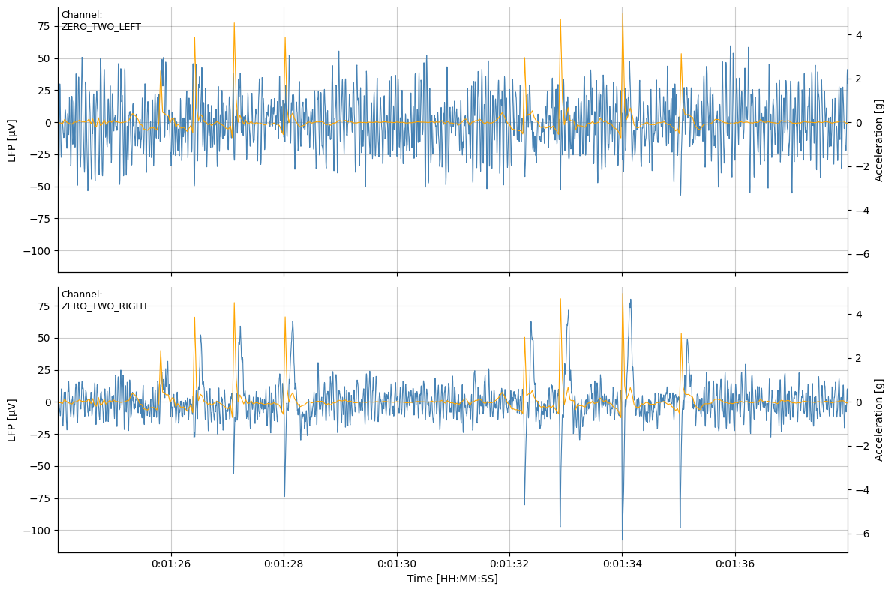
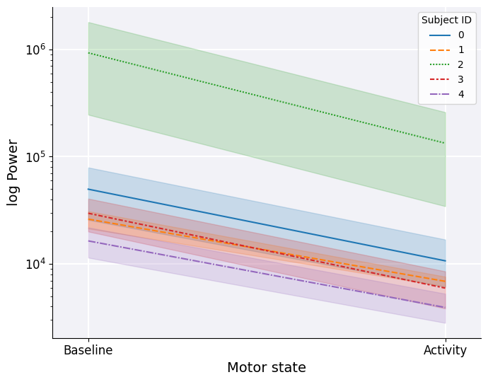

# Introduction to Analysing Brain LFP Signals in the Beta Frequency Band


Understanding the brain's electrical activity is crucial for advancing both neuroscience research and clinical applications. Local Field Potentials (LFPs) offer a unique window into brain dynamics, providing insights into neural oscillations and their role in various cognitive and motor functions. Particularly, the beta frequency band (13-30 Hz) has been extensively studied due to its association with motor control and neurological disorders such as Parkinson's disease.

This tutorial showcases how BrainSight can be used to analyse LFP signals in the beta frequency band, focusing on data collected from both within and outside a patient's motor activity regions. Whether you are a neuroscientist, a clinical researcher, or a data scientist interested in neural data analysis, BrainSight offers powerful tools to explore and interpret LFP data.

### Prerequisites

To make the most out of this tutorial, you should have:

- Basic knowledge of Python programming.
- Familiarity with signal processing concepts.
- An understanding of neural electrophysiology and the significance of the beta frequency band.

In the following sections, we will guide you through the installation process, demonstrate how to read and process the [multimodal datasets](../dataset.md) downloaded from the [Kelvin](https://machinemedicine.com/kelvin/) platform and provide examples of visualizing and interpreting your results.


> **_NOTE:_** To start using BrainSight for analyzing brain LFP signals in the beta frequency band, you'll need to install it following our [installation guide](../../home/install.md).

---

## Reading the Data

In this tutorial we perform the analysis using multimodal dataset files containing both LFP signals captured during standard MDS-UPDRS part III motor assessments and corresponding patient activity regions. To learn how these datasets are created please refer to the [multimodal dataset creation](../dataset.md) page.

Once dataset JSON files have been downloaded into a local directory we can load them one-by-one into our environment.

```python
datasets = {}
# Iterate over the dataset JSON files
for path in glob.glob("../data/datasets/*.json"):
    # Create a Dataset instance
    dataset = brain.Dataset(path)
    # Check if the dataset is synchronised
    if dataset.ASSESSMENT_INFO.SUB_SECOND_SYNCHRONISATION:
        # Use the assessment's reference as a key
        datasets[dataset.ASSESSMENT_INFO.REFERENCE] = dataset
```

We have used each assessment's reference to organise the datasets. Since we are interested in relating patients' activity regions to LFP signals we filter the datasets to those that have been successfully synchronised by the dataset creation pipeline. 

> **_NOTE:_** To learn how we achieve the LFP-video synchronisation check out the [LFP synchronisation](../synchronisation.md) page!

We can verify if the synchronisation has worked as expected by plotting the raw LFP signal together with assessment device's accelerometer reading.

```python
# Select one of the datasets
sample_reference = "Assessment1"

# Create an instance of the LFP module
lfp = brain.LFP(datasets[sample_reference])

# Draw raw LFP signals including the accelerometer reading
fig = lfp.plot(roi=("00:01:24", "00:01:38"), show_accelerometer=True)
```
Output:


As we can see, artefacts induced in the `ZERO_TWO_RIGHT` channel have been aligned with the accelerometer signal captured by the assessment-recording device. To ensure robustness of the analysis it may be a good idea to verify synchronisation for all datasets.

---

## Extracting Beta Power

Now that we have read and verified our datasets, we can get right into the analysis. First, we define some helper functions to extract the information of interest from our samples. Using BrainSight's [`Periodogram`](../../reference/brainsight/modules/periodogram.md) module we can compute the power spectral density (PSD) for the detected activity regions across all LFP channels contained within a dataset. 

``` py
import numpy as np
from collections import defaultdict

def get_band_sum(
    power: np.ndarray, freqs: np.ndarray, band: tuple[int, int]
) -> float:
    """Sum `power` corresponding to frequencies found within the specified `band`"""
    start, stop = band
    (overlap,) = np.where((start <= freqs) & (freqs < stop))
    return np.sum(power[overlap])


def get_activity_band_sums(
    dataset: brain.Dataset, band: tuple[int, int]
) -> dict:
    """Compute the PSD for all channel-activity pairs found in the `dataset`"""

    psd = brain.Periodogram(dataset)

    sums = defaultdict(dict)
    # Iterate over LFP sensing channels
    for channel in dataset.LFP.keys():

        # Iterate over all detected activities
        for activity in dataset.ACTIVITY.keys():

            # Compute the PSD for the activity region
            power, freqs = psd.get_data(channel=channel, roi=activity)
            s = get_band_sum(power, freqs, band)

            sums[("activity", activity)][channel] = s

    return dict(sums)

def get_inactivity_band_sums(dataset: brain.Dataset, band: tuple[int, int]):
    """Compute the mean PSD for all 'inactivity' regions within the `dataset`"""

    psd = brain.Periodogram(dataset)

    # Get activity ROI ends
    roi_ends = sorted(sum(dataset.ACTIVITY.values(), []))[1:-1]

    # Find the average inactivity power for all channels
    channel_sums = defaultdict(list)
    for channel in dataset.LFP.keys():

        # Iterate over compliments of the activity regions
        for start, stop in zip(roi_ends[::2], roi_ends[1::2]):

            power, freqs = psd.get_data(channel, (start, stop))
            s = get_band_sum(power, freqs, band)

            channel_sums[channel].append(s)

        channel_sums[channel] = sum(channel_sums[channel]) / len(
            channel_sums[channel]
        )

    return channel_sums
```

The `get_band_sum` function sums power estimates for frequencies within the specified interval. In our case, we will be interested in the frequency range of 13-30Hz. `get_activity_band_sums` iterates over all LFP channels and activities contained within a dataset computing the power sums. To compute the baseline beta power, ie. within inactivity regions, we assume that motor inactivity occurs inbetween the detected activity regions. Hence, `get_inactivity_band_sums` function finds the compliment of detected activity regions and computes their _average_ beta power.

Putting all functions together we can now process all our samples:

```python
import pandas as pd

beta_band = (13.0, 30.0)  # Frequency band we are interested in

data = list()
for dataset in datasets.values():
    # Compute power in activity and inactivity regions
    power_dict = get_activity_band_sums(dataset=dataset, band=beta_band)
    power_dict[("BASELINE")] = get_inactivity_band_sums(
        dataset=dataset, band=beta_band
    )

    # Construct a dataframe entry with additional assessment information
    df = (
        pd.DataFrame(power_dict)
        .assign(**dataset.ASSESSMENT_INFO)
        .reset_index(names=["CHANNEL"])
        .set_index(
            [
                "SUBJECT_ID",
                "REFERENCE",
                "CHANNEL",
                "MEDICATION_ON",
                "STIMULATION_ON",
            ]
        )
        .drop("SUB_SECOND_SYNCHRONISATION", axis=1)
    )
    data.append(df)

# Concatenate all samples into one dataframe
dataframe = pd.concat(data)
```

And that's it! We have successfully created a dataframe containing beta power estimates for every activity performed by all of our patients. Since our multimodal datasets contain information on the medication and stimulation states, performing more advanced comparisons is right within our reach. Here we see a snippet of the dataframe:


|   SUBJECT_ID | REFERENCE    | CHANNEL        | MEDICATION_ON   | STIMULATION_ON   |   TOE_TAPPING_LEFT |   GAIT_TOWARDS_CAMERA |   POSTURAL_TREMOR_OF_HANDS_LEFT |   GAIT_FROM_CAMERA |   LEG_AGILITY_RIGHT |   ARISING_FROM_CHAIR |   HAND_MOVEMENTS_RIGHT |   TOE_TAPPING_RIGHT |   HAND_MOVEMENTS_LEFT |   FINGER_TAPPING_LEFT |   LEG_AGILITY_LEFT |   FINGER_TAPPING_RIGHT |        BASELINE |
|-------------:|:-------------|:---------------|:----------------|:-----------------|-------------------:|----------------------:|--------------------------------:|-------------------:|--------------------:|---------------------:|-----------------------:|--------------------:|----------------------:|----------------------:|-------------------:|-----------------------:|----------------:|
|            4 | assessment_0 | ZERO_TWO_LEFT  | False           | False            |            1206.13 |               3114.78 |                         1374.42 |            2803.22 |            2915.43  |             1032.72  |                2026.53 |             2524.83 |               2750.41 |               2017.21 |           5610.23  |                2174.24 |  10918.1        |
|            4 | assessment_0 | ZERO_TWO_RIGHT | False           | False            |            1340.77 |               7700.09 |                         2508.54 |            6730.55 |           18382.9   |             2122.44  |                6112.77 |             6102.84 |               7618.44 |               5905.21 |           4968.51  |                5016.53 |  25376.8        |
|            2 | assessment_1 | ZERO_TWO_LEFT  | True            | True             |           27138.8  |              42735.3  |                        35339.6  |           52508.9  |           35950.5   |             7582.67  |               26288.8  |            17765.2  |               3553.74 |                nan    |          26559.6   |                 nan    | 141750          |
|            2 | assessment_1 | ZERO_TWO_RIGHT | True            | True             |           10559.1  |              16654.8  |                        15932    |           17972.3  |           12780.5   |             3222.44  |               15441.8  |             7030.82 |               1655.62 |                nan    |           9399.49  |                 nan    |  55659.1        |
|            4 | assessment_2 | ZERO_TWO_LEFT  | False           | True             |            2002.84 |               3061.84 |                         1832.17 |            3515.71 |            1645.21  |              526.639 |                1398.32 |             2587.47 |               1805.58 |               1042.19 |           3480.59  |                1286.9  |   9709          |
|            4 | assessment_2 | ZERO_TWO_RIGHT | False           | True             |            2343.3  |               6177.3  |                         1945.4  |            6711.53 |           10332.2   |             1002.4   |                1540.19 |             2826.41 |               3387.87 |               1549.9  |           4154.59  |                1413.67 |  15114.5        |
|            2 | assessment_3 | ZERO_TWO_LEFT  | True            | False            |          245191    |                nan    |                       278161    |             nan    |            1779.24  |            10329.2   |              104953    |           687123    |             279759    |             609347    |            992.791 |              287316    |      1.4422e+06 |
|            2 | assessment_3 | ZERO_TWO_RIGHT | True            | False            |           39368.2  |                nan    |                        60891.5  |             nan    |             677.412 |             2784.82  |               27385.5  |           148704    |              54561.2  |              97761.5  |            160.092 |               91954.7  | 332075          |

## Results

We will now compare mean beta activity during and inbetween regions of patient movement. We need to format the dataframe one last time to calculate the mean power across all activities...

```python
# Average power across activities for each row
df_activity = dataframe.drop("BASELINE", axis=1).mean(axis=1)
# Create a plotting dataframe
df_plot = pd.concat([dataframe["BASELINE"], df_activity], axis=1)
df_plot.columns = ["Baseline", "Activity"]
```

...and simply visualise the result:

```python
import matplotlib.pyplot as plt
import seaborn as sns

fig, ax = plt.subplots(figsize=(7, 6))

# Format the Axis
ax.spines["top"].set_visible(False)
ax.spines["right"].set_visible(False)
ax.set_facecolor([0.95, 0.95, 0.97])
ax.set_axisbelow(True)
ax.grid(color="white", lw=1.5)

# Plot the data
sns.lineplot(df_plot.T, ax=ax)
leg = ax.axes.get_legend()
leg.set_title("Subject ID")

# Scale axes and set limits
ax.set_yscale("log")
ax.set_xlim(-0.1, 1.1)

# Set axis labels
ax.set_xlabel("Motor state", fontsize=14)
ax.set_ylabel("log Power", fontsize=14)
ax.tick_params(labelsize=12, left=True)

plt.tight_layout()
```
Output:



The analysis reveals a difference between the two motor states with the estiamted beta power being consistently lower within activity regions. Interestingly, the baseline neuronal activity can vary widely between subjects. 